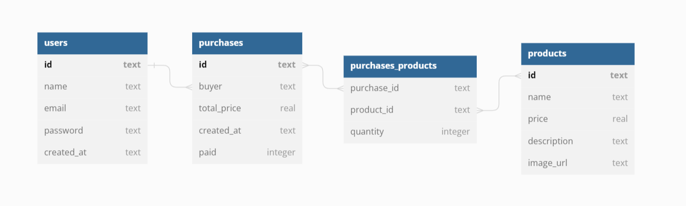

# **Projeto API Labecommerce Backend**

## Índice:

- <a href="#Objetivo"> Objetivo </a>
- <a href="#Estruturação do banco de dados"> Estruturação do banco de dados </a>
- <a href="#funcionalidades-do-projeto"> Funcionalidades do Projeto </a>
- <a href="#Documentação da API"> Documentação da API </a>
- <a href="#Como rodar este projeto?"> Como rodar este projeto? </a>
- <a href="#Técnologias utilizadas"> Técnologias utilizadas </a>
- <a href="#pessoas-autoras">Pessoas Autoras</a>
- <a href="#Próximos Passos"> Próximos Passos </a>

## Objetivo

O objetivo desse projeto é a criação de API com funcionalidades CRUD no projeto Labecommerce - Backend. Criar uma API funcional para o dia a dia de um E-commerce, com cadastros de usuários, produtos e compras, assim como meios para gerenciá-los.

## Estruturação do banco de dados



## Funcionalidades do Projeto

- [x] Cadastro de usuário
- [x] Cadastro de produtos
- [x] Cadastro de compras
- [x] Visualizar usuários cadastrados
- [x] Visualizar produtos cadastrados
- [x] Visualizar compras cadastradas, junto com dados do usuário que realizou a compra e informações dos produtos adicionados
- [x] Editar informações do usuário
- [x] Editar informações do produto
- [x] Deletar usuário
- [x] Deletar produto
- [x] Deletar compra

## Documentação da API

Link para acessar a documentação:
[API Labecommerce](https://documenter.getpostman.com/view/25857659/2s93Xwy3t4)

## Como rodar este projeto?

```bash
# Clone este repositório
$ git clone link-repo

# Acesse a pasta do projeto no seu terminal
$ cd nomeDaPasta

# Instale as dependencias
$ npm install

# Execute a aplicação
$ npm run dev

# A aplicação será iniciada na porta 3004, acesse pelo navegador: http://localhost:3004

```

## Tecnologias utilizadas

1. [Node.js](https://nodejs.org/en)
2. [TypeScript](https://www.typescriptlang.org/)
3. [Express](https://expressjs.com/)
4. [Knex](https://knexjs.org/)
5. [SQLite3 / SQL](https://sqlite.org/index.html)
6. [Postman](https://www.postman.com/)

## Pessoas Autoras


[LinkedIN](https://www.linkedin.com/in/-lucas-tavares/)

Email: lucas.c.d.tavares@gmail.com

## Próximos Passos

- [ ] Deploy
- [ ] Testes unitários